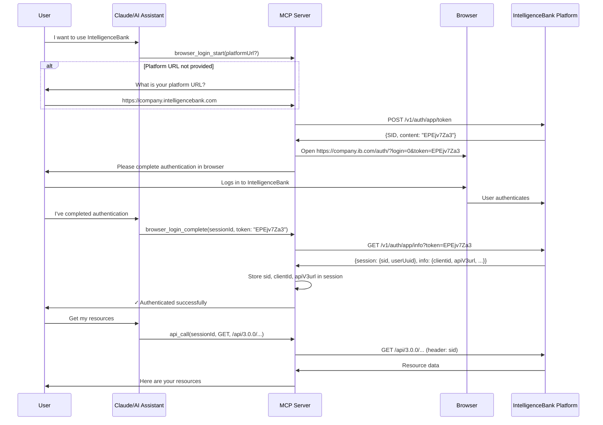

# Current Task: Browser-Based Direct Authentication Flow

## Context

We want to test a **simpler, browser-based authentication approach** that bypasses the OAuth wrapper complexity entirely. This uses IntelligenceBank's native browser login API to directly obtain session credentials (`sid`, `clientId`, `apiV3url`).

## Current Architecture (OAuth-based)

The existing system uses:
1. **OAuth 2.0 Bridge**: AWS Lambda service that wraps IB authentication
2. **Dual Authentication**: OAuth tokens (MCP compliance) + IB session (API calls)
3. **Multiple API Calls**: `/authorize` → user login → `/callback` → `/token` exchange → extract IB session

## Proposed Architecture (Browser-based Direct)

A simplified flow that directly uses IntelligenceBank's browser login API:



## Browser Login API Flow

### Step 1: Initiate Browser Login
**Endpoint:** `POST https://{{platformUrl}}/v1/auth/app/token`

**Response:**
```json
{
    "SID": "c9sim2jucii3fulckgthfgruh7",
    "content": "EPEjv7Za3"
}
```

### Step 2: Open Browser for Authentication
**URL:** `https://{{platformUrl}}/auth/?login=0&token={{content}}`

User completes authentication in browser (no redirect back to MCP server needed).

### Step 3: Complete Authentication
**Endpoint:** `GET https://{{platformUrl}}/v1/auth/app/info?token={{content}}`

**Response:**
```json
{
    "SID": "c9sim2jucii3fulckgthfgruh7",
    "content": {
        "session": {
            "sid": "583fnd6cu83t72ruddgeubpcq4",
            "userUuid": "85c14d9c716d11284aadff372ab6f01f",
            "originalUserUuid": null,
            "loginTime": 1578413767
        },
        "info": {
            "clientname": "The IntelligenceBank Trial",
            "clientuuid": "fe97709573d7929e8cba2f21fa8fb1ca",
            "clientid": "8yqy",
            "sid": "583fnd6cu83t72ruddgeubpcq4",
            "apikey": "423680dd45b57239424fd6301a608f2d",
            "apiV3url": "https://lbv3us1.intelligencebank.com",
            "logintimeoutperiod": 120,
            ...
        }
    }
}
```

## Required Session Data

From the final response, we must store:

1. **`sid`** (from `content.session.sid`): Session ID for all API calls
2. **`clientid`** (from `content.info.clientid`): IB client identifier  
3. **`apiV3url`** (from `content.info.apiV3url`): API base URL
4. **`logintimeoutperiod`** (from `content.info.logintimeoutperiod`): Session lifetime in hours

These are stored in the existing `AuthSession.ibSession` structure.

## Implementation Plan

### Phase 1: Create New Browser Login Tool ✓

- [ ] Create `src/tools/browser-login.tool.ts`
  - [ ] `browser_login_start` - Initiates flow, returns browser URL
  - [ ] `browser_login_complete` - Completes flow, fetches credentials
- [ ] Add tool registration in `src/index.ts`
- [ ] Update SessionManager to support browser login sessions
- [ ] Add browser login session type to `session.types.ts`

### Phase 2: Implement Browser Login Flow

#### Tool 1: browser_login_start

**Input:**
- `platformUrl` (optional): IntelligenceBank platform URL

**Process:**
1. If `platformUrl` not provided, return error asking for it
2. Call `POST https://{{platformUrl}}/v1/auth/app/token`
3. Create MCP session with:
   - `sessionId`: Generated MCP session ID
   - `platformUrl`: User's platform
   - `browserToken`: The `content` value from response
   - `browserSID`: The `SID` value from response
   - `status`: 'browser_pending'
4. Construct browser URL: `https://{{platformUrl}}/auth/?login=0&token={{content}}`

**Output:**
```json
{
  "sessionId": "abc123...",
  "browserUrl": "https://company.ib.com/auth/?login=0&token=EPEjv7Za3",
  "instructions": "Please visit the URL above in your browser and complete the login process. Once you've logged in, let me know and I'll complete the authentication."
}
```

#### Tool 2: browser_login_complete

**Input:**
- `sessionId`: Session ID from browser_login_start

**Process:**
1. Retrieve session from SessionManager
2. Verify session exists and status is 'browser_pending'
3. Call `GET https://{{platformUrl}}/v1/auth/app/info?token={{browserToken}}`
4. Extract and store in `session.ibSession`:
   - `sid`: From `content.session.sid`
   - `clientId`: From `content.info.clientid`
   - `apiV3url`: From `content.info.apiV3url`
   - `logintimeoutperiod`: From `content.info.logintimeoutperiod`
5. Store user info in `session.userInfo`
6. Update session status to 'completed'

**Output:**
```json
{
  "status": "completed",
  "authenticated": true,
  "userInfo": {
    "firstName": "John",
    "lastName": "Doe",
    "email": "john@example.com"
  },
  "sessionExpiry": "2025-02-01T15:30:00Z"
}
```

### Phase 3: Update Existing Components

- [ ] Update `SessionManager.ts`:
  - [ ] Add `browserToken` and `browserSID` to session storage
  - [ ] Support 'browser_pending' status
- [ ] Update `session.types.ts`:
  - [ ] Add optional `browserToken?: string`
  - [ ] Add optional `browserSID?: string`
  - [ ] Add optional `platformUrl?: string`
- [ ] Keep `api-call.tool.ts` unchanged (already uses `ibSession.sid`)

### Phase 4: Testing & Validation

- [ ] Test browser login flow locally
  - [ ] Call `browser_login_start` with platformUrl
  - [ ] Open browser URL and login
  - [ ] Call `browser_login_complete` 
  - [ ] Verify session has valid `ibSession` data
- [ ] Test API calls with browser-authenticated session
  - [ ] Call `api_call` with sessionId from browser login
  - [ ] Verify API calls use `sid` correctly
- [ ] Test session expiry handling
  - [ ] Verify 401 responses prompt re-authentication

### Phase 5: Documentation

- [ ] Create `docs/browser-login-flow.md`
  - [ ] Document complete flow with examples
  - [ ] Include sequence diagrams
  - [ ] Add troubleshooting guide
- [ ] Update `README.md`
  - [ ] Add browser_login_start and browser_login_complete tools
  - [ ] Include usage examples
  - [ ] Note this as experimental/alternative to OAuth
- [ ] Update `docs/authentication-architecture.md`
  - [ ] Add section on browser-based authentication
  - [ ] Compare OAuth vs browser login approaches
  - [ ] Document when to use each method

## Comparison: OAuth Bridge vs Browser Login

| Aspect | OAuth Bridge (Current) | Browser Login (Proposed) |
|--------|----------------------|--------------------------|
| **Complexity** | High (4+ API calls, token exchange) | Low (2 API calls) |
| **Dependencies** | Requires OAuth bridge AWS Lambda | Direct to IB platform |
| **Steps** | 5 steps with redirects | 3 steps (start → user login → complete) |
| **MCP Compliance** | Full OAuth 2.0 compliance | Custom flow (may not be standard) |
| **Token Management** | OAuth tokens + IB session | IB session only |
| **User Experience** | Automatic redirect, seamless | Manual step confirmation required |
| **Maintenance** | Requires OAuth bridge maintenance | No bridge needed |
| **Session Data** | Dual auth (OAuth + IB) | Single auth (IB only) |

## Key Differences from OAuth Flow

1. **No Redirect Back**: Browser login doesn't redirect back to MCP server
2. **User Confirmation Required**: User must tell AI when they've completed login
3. **Direct IB API**: No OAuth bridge intermediary
4. **Simpler State Management**: No PKCE, no state parameter
5. **Single Credential Set**: Only IB session, no OAuth tokens

## Advantages of Browser Login

1. **Simplicity**: 2 API calls vs 4+ in OAuth flow
2. **No Bridge Dependency**: Direct communication with IB platform
3. **Easier Debugging**: Fewer moving parts
4. **Transparent**: User sees IB login directly
5. **Less Code**: Simpler implementation and maintenance

## Potential Concerns

1. **MCP Compliance**: May not follow standard OAuth patterns
2. **User Experience**: Requires manual confirmation step
3. **Session Management**: Need to handle session expiry gracefully
4. **Multi-Platform**: Need to ask for platformUrl if not provided
5. **Security**: Ensure token is properly secured during the flow

## Success Criteria

- [ ] User can authenticate without OAuth bridge
- [ ] Session credentials (`sid`, `clientId`, `apiV3url`) are correctly stored
- [ ] `api_call` tool works identically with browser-authenticated sessions
- [ ] Session expiry is handled gracefully (401 → re-authenticate)
- [ ] Documentation is clear and complete
- [ ] Code is cleaner and easier to maintain than OAuth flow

## Next Steps

1. Review this plan with stakeholders
2. Get approval to proceed with implementation
3. Create browser login tool implementation
4. Test thoroughly in development environment
5. Compare user experience vs OAuth flow
6. Decide whether to:
   - Keep both methods (OAuth + browser login)
   - Replace OAuth with browser login
   - Use browser login as fallback

## Open Questions

1. Should we keep OAuth flow as primary or make browser login the default?
2. How do we handle platforms that don't support browser login API?
3. Should we auto-detect which method to use based on platform?
4. What happens if user closes browser without completing login?
5. How long should we wait for user to complete browser authentication?

## Implementation Notes

- **Reuse Existing Code**: Leverage `SessionManager`, `AuthSession` structure, `api-call.tool`
- **No Breaking Changes**: Keep OAuth flow intact, add browser login as alternative
- **Consistent Interface**: Browser login tools should feel similar to OAuth tools
- **Clear Naming**: Use `browser_login_*` prefix to distinguish from `auth_*` tools
- **Progressive Enhancement**: Start simple, add features based on testing

## Timeline Estimate

- **Phase 1-2** (Implementation): 2-3 hours
- **Phase 3** (Integration): 1 hour  
- **Phase 4** (Testing): 2-3 hours
- **Phase 5** (Documentation): 1-2 hours
- **Total**: 6-9 hours for complete implementation and testing

## Related Files

Key files to modify/create:
- `src/tools/browser-login.tool.ts` (NEW)
- `src/types/session.types.ts` (UPDATE)
- `src/session/SessionManager.ts` (UPDATE - add browser session support)
- `src/index.ts` (UPDATE - register new tools)
- `docs/browser-login-flow.md` (NEW)
- `docs/authentication-architecture.md` (UPDATE)
- `README.md` (UPDATE)

Existing files to keep unchanged:
- `src/tools/api-call.tool.ts` (NO CHANGE - already uses ibSession.sid)
- `src/auth/oauth-callback.ts` (NO CHANGE - OAuth flow remains)
- `src/tools/auth-login.tool.ts` (NO CHANGE - OAuth flow remains)
- `src/tools/auth-status.tool.ts` (NO CHANGE - works with both flows)